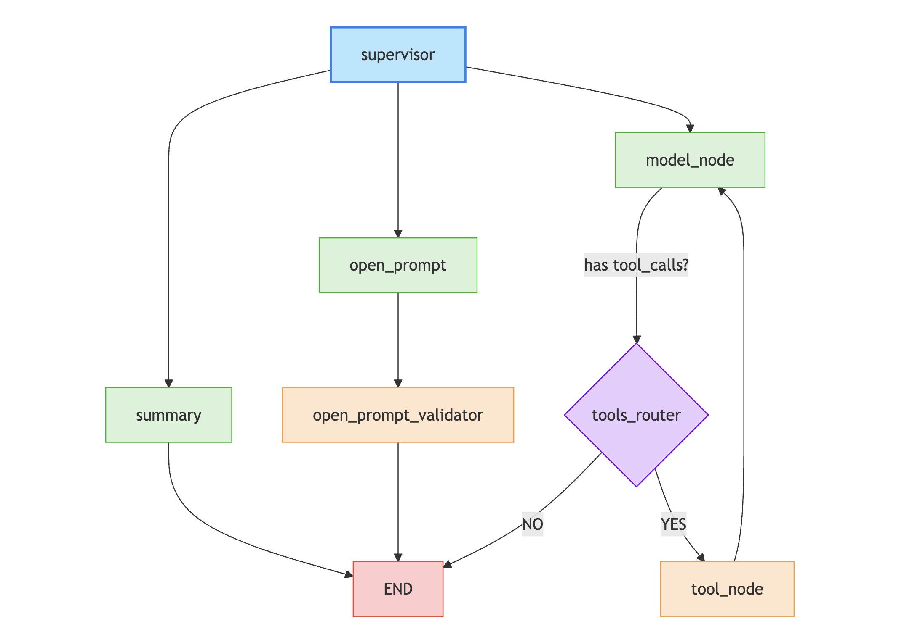

# Chatbot-LangGraph 

This project implements a chatbot application using LangGraph, LangChain, and FastAPI. The chatbot is designed to process user queries, analyze data, and provide insights using a multi-agent system. It integrates tools like OpenAI's GPT models and Tavily Search for enhanced functionality.

## UI codebase

UI - https://github.com/GowthamS05/chatbot-langgraph-ui

## Demo

- Service - https://saleschatbot-latest.onrender.com/docs
- UI -  https://gowthams05.github.io/chatbot-langgraph-ui/

## Images


## Architecture



## Features

- **Multi-Agent System**: Implements a supervisor agent to route user queries to appropriate specialists.
- **Data Analysis**: Converts user queries into pandas DataFrame formulas for data analysis.
- **Search Integration**: Uses Tavily Search for retrieving external information.
- **Streaming Responses**: Provides real-time responses using Server-Sent Events (SSE).
- **Checkpointing**: Supports conversation checkpointing for maintaining context across sessions.

## Project Structure

- **Supervisor Agent**: Routes user queries to appropriate nodes (`summary`, `open_prompt`, or `model`).
- **Data Analysis Nodes**:
  - `open_prompt`: Converts user queries into pandas DataFrame formulas.
  - `open_prompt_validator`: Validates the generated formulas and provides insights.
  - `summary`: Summarizes data statistics and provides key insights.
- **Search Node**: Handles external search queries using Tavily Search.
- **Streaming API**: Exposes an endpoint for real-time chat responses.

## Installation

1. Clone the repository:
   ```bash
   git clone https://github.com/your-repo/chatbot-langgraph.git
   cd chatbot-langgraph/server

2. Install dependencies:
pip install -r requirements.txt

3. .env file
    TAVILY_API_KEY=your_tavily_api_key
    LANGSMITH_TRACING=true
    LANGSMITH_ENDPOINT="https://api.smith.langchain.com"
    LANGSMITH_API_KEY="your_langsmith_api_key"
    LANGSMITH_PROJECT="chatbot_agent"
    OPENAI_API_KEY=your_openai_api_key

## Run the server
 1. Start the FastAPI server:
    uvicorn main:main --host 0.0.0.0 --port 8000

 2. Access the streaming endpoint:


   


